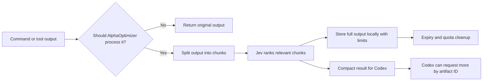

# AlphaOptimizer

AlphaOptimizer is an open-source tool from AlphaTales that helps Codex work with large command and
tool outputs. Instead of sending a huge log or search result straight into the context window,
AlphaOptimizer keeps the useful parts visible, keeps the original output available for a limited
time, and uses Jev to help rank what matters when an API key is configured.

## Observed Results

In initial AlphaTales tests, AlphaOptimizer reduced large tool-output payloads by about 60-65% on
average, with many runs sitting around 65%. The smallest reductions we saw were around 45%, and the
largest reached about 80%.

Actual results depend on the shape of the output and the task. These figures describe observed
context-payload reduction for eligible large outputs, not guaranteed billing savings.

## How It Works

Codex often runs commands that produce far more text than it needs: test logs, build errors,
repository searches, generated reports, or long tool responses. Large outputs can bury the useful
lines and waste context. AlphaOptimizer sits between those outputs and Codex.



The process is:

1. A command or tool returns text.
2. AlphaOptimizer checks whether the output is worth processing.
3. Small outputs, failed outputs, structured data, media, unsupported results, and secret-looking
   content pass through unchanged.
4. The text is split into chunks so it can be searched and selected.
5. Obvious diagnostics such as failures, expected/actual values, and important matches are preserved.
6. AlphaOptimizer sends a small bounded set of normal, non-sensitive chunks to Jev for relevance
   ranking.
7. After Jev responds, the full supported output is stored in a private local data folder.
8. Codex receives a shorter result with selected lines and an artifact ID.
9. If Codex needs more detail, it can read from the stored original output using that artifact ID.
10. Stored output expires or is evicted by the configured cleanup rules.

Jev is used when `ALPHAOPTIMIZER_JEV_API_KEY` is provided.

## Installation

> [!IMPORTANT]
> **Required setup: add your Jev API key and trust the AlphaOptimizer hooks.**
>
> **1. Add the Jev key to Codex's `config.toml`.** The default user configuration is
> `~/.codex/config.toml` on macOS/Linux, or `%USERPROFILE%\.codex\config.toml` on Windows.
> If you set `CODEX_HOME`, use the `config.toml` inside that directory instead.
> In your existing AlphaOptimizer MCP server configuration, add or update:
>
> ```toml
> [mcp_servers.alphaoptimizer.env]
> ALPHAOPTIMIZER_JEV_API_KEY = "paste-your-jev-api-key-here"
> ```
>
> Keep the server's existing `command`, `args`, and `cwd`. If the `env` table already exists,
> add the key there rather than duplicating the table. This snippet adds a credential to an
> already registered server; it does not register the server by itself. Keep the real key
> in your user configuration, not in this repository.
>
> **2. Review and trust the hooks in Codex.** In the desktop app, open **Settings** and
> find **Hooks**, then review and trust AlphaOptimizer's `SessionStart` and `PostToolUse`
> entries. Installing or enabling the plugin alone does **not** approve its hooks.
> If your app version does not expose that control, open the Codex CLI using the same
> `CODEX_HOME`, enter **`/hooks`**, and review and trust those AlphaOptimizer entries there.
> Changed hook definitions require a new trust review after an update.
>
> **3. Restart Codex and start a new task** so the MCP server reads the key and the
> session hook loads. Use `optimization_status` to check configuration and event delivery.
> These are required setup steps, **not proof that the current installation works**:
> the clean-install hook-delivery issue below remains unresolved.

Setup references: OpenAI's [MCP configuration](https://learn.chatgpt.com/docs/extend/mcp#configure-with-configtoml),
[configuration file location](https://learn.chatgpt.com/docs/config-file/config-basic#codex-configuration-file),
[hook trust instructions](https://learn.chatgpt.com/docs/hooks#review-and-trust-hooks), and
[desktop hook-review release note](https://learn.chatgpt.com/docs/changelog) (Codex app 26.506, 8 May 2026).

**Release validation pending:** the clean installed-plugin hook probe is failing. Do not treat
installation as proof of active optimization. See [verification and blockers](docs/installation-verification.md).

Install the platform bundle for your operating system and CPU in Codex, then supply
`ALPHAOPTIMIZER_JEV_API_KEY` in the MCP server environment. Filtering and the native hooks are
included by default. Codex still requires its own hook trust review; an installed but untrusted
plugin cannot intercept tool output. No `hooks:enable` command or `AGENTS.md` edits are required
for bundled plugin installations. Start a new task after installation so session instructions load.

Platform bundles include Node and native dependencies. They require no global npm package or
Node installation. They are built by `npm run package:plugin` and the platform CI workflow;
Windows/Linux bundles must pass their actual platform checks before release. This source change
does not update previously installed copies or publish a release.

For development or a source-based plugin installation, Node 22 or 24 and npm are required.
The source launcher installs locked production dependencies in the plugin data directory on first
start if absent. It never runs package lifecycle scripts, and validates native SQLite before serving.

Call `optimization_status` to distinguish disabled/missing-key configuration from a server awaiting
hook delivery. A received processing event is not proof that the model received reduced output.

## Configuration

By default, AlphaOptimizer works as a global Codex plugin across any project directory. It still
records the canonical workspace path with each stored output so later reads stay tied to the correct
workspace and session.

Common options:

- `ALPHAOPTIMIZER_MODE`: `off`, `observe`, or `filter`. Default: `filter`.
- `ALPHAOPTIMIZER_AUTO_MODE`: `off`, `observe`, or `filter`. Default: `filter`; `observe` never replaces automatic results.
- `ALPHAOPTIMIZER_RETENTION_DAYS`: how long stored outputs are kept. Default: `14`.
- `ALPHAOPTIMIZER_MAX_STORE_BYTES`: local storage budget. Default: `268435456`.
- `ALPHAOPTIMIZER_METRICS_ENABLED`: set to `false` to disable local metrics.

To disable capture and selection completely:

```sh
ALPHAOPTIMIZER_MODE=off
```

To connect Jev:

```sh
ALPHAOPTIMIZER_JEV_API_KEY=your-key
```

See [Jev provider details](docs/provider-jev.md) before enabling it.

## Privacy

AlphaOptimizer is designed as a local trusted-process tool.

By default:

- Full processed outputs are stored locally under `~/.local/share/alphaoptimizer`.
- Data, artifact, and metrics folders must be private to the current user. On Windows,
  AlphaOptimizer hardens each folder with NTFS permissions for the current user,
  `SYSTEM`, and local Administrators.
- Stored outputs expire after 14 days.
- The total store budget defaults to 256 MiB.
- Old unprotected outputs are evicted when the store needs space.
- Expired outputs are cleaned on startup, before capture, and during regular sweeps.

Jev is used when `ALPHAOPTIMIZER_JEV_API_KEY` is configured. AlphaOptimizer sends only bounded
candidate chunks labelled `normal`; sensitive and secret outputs are not sent to Jev.

## Implemented Safeguards

- Secret-looking outputs are skipped before capture.
- Outputs marked `secret` are not captured.
- Oversized artifacts pass through unchanged.
- Repository search uses workspace checks and avoids symlinks and sensitive paths by default.
- Local storage has retention and quota limits.
- AlphaOptimizer does not approve permissions or suppress destructive actions.
- AlphaOptimizer does not claim actual Codex billing savings; metrics are payload estimates only.

## License

AlphaOptimizer is released under the [MIT License](LICENSE).

Copyright (c) 2026 AlphaTales. Created by Libin Joseph.

## Standalone MCP installations

A standalone MCP registration does not install plugin lifecycle hooks. This is an advanced
integration, not the normal plugin installation. See [automatic integration](docs/automatic-use.md)
for migration and host limitations.

## Development

```sh
npm install
npm test
npm run typecheck
npm run typecheck:tests
npm run build
npm run test:package
```

## Metrics

Metrics are enabled by default. They record request counts, timing, estimated before/after payload
size, fallback reasons, and Jev usage when available.

Metrics do **not** measure actual Codex billing or total token savings. They are local estimates.

```sh
npm run metrics
npm run metrics -- --recent
```

See [metrics details](docs/metrics.md).
